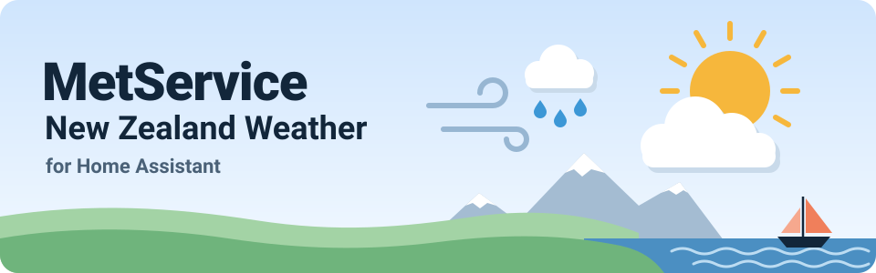
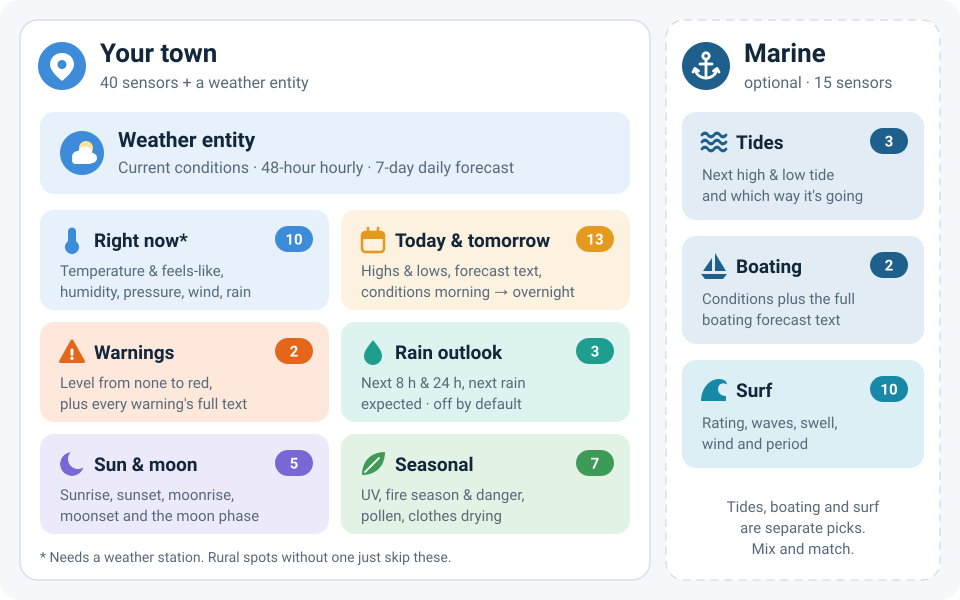
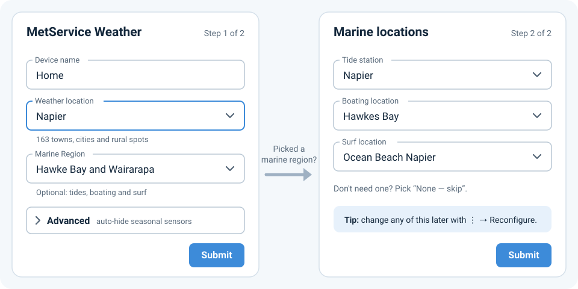
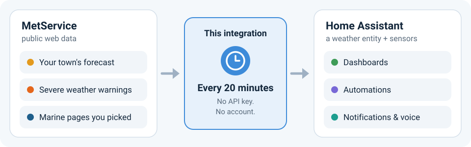
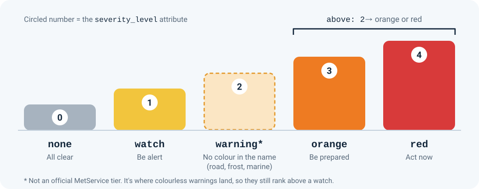

[](https://hacs.xyz/docs/faq/custom_repositories/)
[](https://github.com/nagelm/metservice-weather/releases/latest)
[](https://github.com/nagelm/metservice-weather/actions/workflows/test.yml)
[](https://github.com/nagelm/metservice-weather/actions/workflows/validate.yml)
[](LICENSE)

Kia ora! 👋 This integration brings [MetService](https://www.metservice.com) weather into Home Assistant: live observations, hourly and 7-day forecasts, severe weather warnings, UV, pollen and fire danger, plus tides, boating and surf if you're near the coast.

It reads the same public data the MetService website uses, so there's **no API key and no account**. Just pick your town.

[](https://my.home-assistant.io/redirect/hacs_repository/?owner=nagelm&repository=metservice-weather&category=integration)

## ✨ What you get



- 🌤️ **A weather entity** for your forecast cards: current conditions, a 48-hour hourly forecast and a 7-day daily forecast.
- 📊 **40 sensors for your town**, from temperature and wind to warnings, UV, pollen, fire danger, sunrise and the moon phase.
- ⚓ **Up to 15 marine sensors** for tides, boating and surf, if you pick a marine region.
- 🔁 **Fresh data every 20 minutes**, straight from MetService.
- 🧭 **163 places to choose from**: towns, cities and rural spots all over Aotearoa.

## 🚀 Get started

> [!NOTE]
> You'll need **Home Assistant 2026.8 or newer** and [HACS](https://hacs.xyz). MetService only covers New Zealand, so this one's for Kiwi locations only.

1. **Install it with HACS.** Hit the button above, or add it by hand: **HACS → ⋮ → Custom repositories**, paste `https://github.com/nagelm/metservice-weather`, choose **Integration**, then search for **MetService New Zealand Weather** and download it.
2. **Restart Home Assistant.**
3. **Add the integration.** This button jumps straight there, or go to **Settings → Devices & services → Add integration** and search for **MetService**.

   [](https://my.home-assistant.io/redirect/config_flow_start/?domain=metservice_weather)

Setup is one screen, or two if you want marine data:



- **Device name** is just the label in your integrations list. The device and its sensors are named after the place you pick, so Napier gets you `sensor.napier_temperature` and `weather.napier_forecast`.
- **Marine Region** is optional. Pick one and the second screen lets you choose a tide station, a boating spot and a surf spot. Skip any you don't need.
- **Advanced** holds one switch. Turn it on and the seasonal sensors (UV, fire danger, clothes drying) disable and hide themselves while MetService pauses them, then come back on their own when the data returns, history and all. Leave it off and they just read `unknown` off-season.

Want more than one town? Add the integration again. Every location gets its own device (you can't add the same one twice).

<details>
<summary>Installing without HACS</summary>

Copy the `custom_components/metservice_weather` folder into your Home Assistant `config/custom_components/` folder, then restart Home Assistant.

</details>

## 🔌 How it works



Every 20 minutes the integration reads MetService's public web data for your town, the current severe weather warnings and whichever marine pages you picked, then updates your weather entity and sensors. Nothing to sign up for and no keys to look after.

## 🌦️ The sensors

Here's the lot. Open a group to see what's in it.

<details>
<summary><b>The weather entity</b>: for forecast cards</summary>

| Part | What's in it |
|---|---|
| Now | Condition (it switches to `clear-night` once the sun's down), temperature, humidity, pressure, wind speed and direction |
| Hourly, 48 hours | Condition, temperature, rainfall, wind speed and direction |
| Daily, 7 days | Condition, high and low, chance of rain, and the expected rainfall in mm for today and tomorrow (see [where's the chance of rain?](#-good-to-know)) |

</details>

<details>
<summary><b>Right now</b>: live observations (10)</summary>

These come from a weather station, so rural spots without one don't get them.

| Sensor | What it tells you |
|---|---|
| Temperature | The current temperature |
| Temperature feel | How warm it actually feels, according to MetService |
| Relative humidity | In % |
| Pressure | In mbar (the same as hPa) |
| Pressure tendency | `rising`, `falling` or `stable` |
| Wind speed, Wind gust | In km/h |
| Wind direction | A compass point, like `SW` |
| Wind strength | MetService's Beaufort-style scale, from `calm` up to `storm` |
| Rain last hour | Millimetres recorded over the last hour. It drops back to 0 when the rain stops, so it's not a daily total |

</details>

<details>
<summary><b>Today &amp; tomorrow</b>: the forecast (13)</summary>

| Sensor | What it tells you |
|---|---|
| High temperature today, Low temperature today | Today's high and low, observed or forecast |
| Weather description | Today's forecast in plain English |
| Condition today | MetService's own condition word for word (`few-showers`, `fine-night`, …), for custom cards that draw MetService's exact icons. The `daily_conditions` attribute has the same token for every day of the 7-day forecast, keyed by date (not stored in the database) |
| Condition morning, afternoon, evening, overnight | Today's part-of-day outlook, like `partly-cloudy` (where MetService publishes it) |
| Condition tomorrow | Tomorrow's condition, like `few-showers` |
| High temperature tomorrow, Low temperature tomorrow | Tomorrow's high and low |
| Weather description tomorrow | Tomorrow's forecast in plain English |
| Forecast issued | When MetService issued the current forecast |

</details>

<details>
<summary><b>Warnings</b>: severe weather (2)</summary>

| Sensor | What it tells you |
|---|---|
| Warnings | The most severe warning in force: `none`, `watch`, `warning`, `orange` or `red`. Attributes: `headline` (the top warning's name), `count` and `severity_level` (see [Warnings](#%EF%B8%8F-warnings)) |
| Warning details | How many warnings are active. The `active_warnings` attribute lists every one in full, with its name, text and threat period (not stored in the database) |

</details>

<details>
<summary><b>Rain outlook</b>: off by default (3)</summary>

Switch these on from the device page if you want them.

| Sensor | What it tells you |
|---|---|
| Rain next 8 hours, Rain next 24 hours | Millimetres expected, from the hourly forecast |
| Next rain expected | When the next rain is due: the first rainy hour in the hourly forecast, otherwise the first rainy day in the 7-day forecast (`precision` says `hour` or `day`). A dry forecast reads `unknown`, with `outlook: no_rain_expected` and a `forecast_horizon` attribute |

</details>

<details>
<summary><b>Sun &amp; moon</b> (5)</summary>

| Sensor | What it tells you |
|---|---|
| Sunrise, Sunset | Timestamps. The old `7:42am`-style text lives in the `display` attribute |
| Moonrise, Moonset | Same again |
| Moon phase | All eight phases, `new_moon` through to `waning_crescent`. The next big phase change is in the `next_phase` and `next_phase_at` attributes |

</details>

<details>
<summary><b>Seasonal</b>: UV, fire, pollen and washing (7)</summary>

Some of these take a break for part of the year. See [why a sensor might say `unknown`](#-good-to-know).

| Sensor | What it tells you |
|---|---|
| UV index | `low`, `moderate`, `high`, `very_high` or `extreme`, with MetService's advice and the sun-protection window as attributes |
| Fire season | `open`, `restricted` or `prohibited` (Fire and Emergency NZ), with `scope` and `detail` attributes |
| Fire danger | `low` through to `extreme` (NIWA's fire danger index), with `index`, `guidance` and `tomorrow` attributes |
| Pollen | `none`, `low`, `moderate` or `high`, all year. The allergens behind it are in `low_allergens`, `moderate_allergens` and `high_allergens`, and ones about to start their season are in `imminent_allergens` |
| Clothes drying morning, Clothes drying afternoon | How long your washing will take to dry, like `4 - 6 hrs` |
| Clothes drying next good day | The next good day for it, like `Today` |

</details>

<details>
<summary><b>Marine</b>: tides, boating and surf (15)</summary>

These sit on a separate device named after your marine region, and only show up for the spots you picked.

| Sensor | Needs | What it tells you |
|---|---|---|
| Next high tide, Next low tide | Tide station | Timestamps, with the tide height in the `height_m` attribute |
| Tide direction | Tide station | `rising` or `falling`, with the whole day's `tide_table` attribute (not stored in the database). Off by default |
| Boating conditions | Boating location | MetService's summary for the day |
| Boating forecast | Boating location | The boating forecast in plain English |
| Surf conditions | Surf location | How good it's looking, like `Good` |
| Surf rating, wave height, set face | Surf location | The rating, and wave heights in metres |
| Surf swell direction, swell height | Surf location | Where the swell's coming from, and its height |
| Surf wind direction, wind speed, wind gust | Surf location | Wind at the break, in knots |
| Surf period | Surf location | Seconds between waves |

</details>

> [!TIP]
> A sensor's state can only hold 255 characters, so a long forecast gets cut off with `...`. When that happens, the whole text is in the `full_description` attribute. The [recipe below](#show-the-whole-forecast-text) shows it on a dashboard.

## ⚠️ Warnings



The **Warnings** sensor shows the most severe warning in force for your area. MetService's official scale goes watch → orange → red. `warning` is an extra bucket this integration adds for warnings with no colour in their name (road snowfall, frost and marine warnings), so they still rank above a watch.

Enum states can't be compared like numbers, so the `severity_level` attribute carries the same thing as a number from 0 to 4. That makes "orange or worse" easy:

```yaml
triggers:
  - trigger: numeric_state
    entity_id: sensor.napier_warnings
    attribute: severity_level
    above: 2 # orange or red
```

**Want notifications without writing any YAML?** Import the ready-made blueprint. It sends you every active warning's full text when a warning is issued or upgraded (including an extra warning arriving while a worse one is already active), filtered to the lowest level you care about:

[](https://my.home-assistant.io/redirect/blueprint_import/?blueprint_url=https%3A%2F%2Fraw.githubusercontent.com%2Fnagelm%2Fmetservice-weather%2Fmain%2Fblueprints%2Fautomation%2Fmetservice_weather%2Fwarning_notifications.yaml)

<details>
<summary>Catching every new warning, not just a change in level</summary>

The state only changes when the *most severe* level changes. A second, lower warning turning up while a worse one is active only bumps the `count` attribute, so trigger on that instead:

```yaml
triggers:
  - trigger: state
    entity_id: sensor.napier_warnings
    attribute: count
```

</details>

## 🍳 Recipes

These use Napier's entity IDs. Swap in your own from **Settings → Devices & services → Entities**.

### Warning headline on a tile

Tiles can show an attribute right next to the state:

```yaml
type: tile
entity: sensor.napier_warnings
state_content:
  - state
  - headline
```

The same trick works for Pollen (`low_allergens`) and the tide sensors (`height_m`).

### Every warning, in full

A markdown card lists each active warning and tidies itself away when things are quiet:

```yaml
type: markdown
content: |
  
  **{{ w.name }}** ({{ w.threat_period }})
  {{ w.text }}
  ---
  
  No active warnings 🎉
```

### Show the whole forecast text

**Weather description**, **Weather description tomorrow** and **Boating forecast** keep their full text in `full_description` whenever the state gets cut off. This shows the full text either way:

```yaml
type: markdown
content: >
  {{ state_attr('sensor.napier_weather_description_tomorrow', 'full_description')
     or states('sensor.napier_weather_description_tomorrow') }}
```

### Chance of rain as a sensor

Home Assistant keeps forecasts out of entity attributes, so the chance of rain lives in the forecast itself. Forecast cards can show it (HA's built-in weather card doesn't, but custom cards like clock-weather-card do), and a template sensor can pull it out with `weather.get_forecasts`:

```yaml
template:
  - triggers:
      - trigger: time_pattern
        minutes: /30
    actions:
      - action: weather.get_forecasts
        target:
          entity_id: weather.napier_forecast
        data:
          type: daily
        response_variable: forecast
    sensor:
      - name: Chance of rain in 3 days
        unit_of_measurement: "%"
        state: "{{ forecast['weather.napier_forecast'].forecast[3].precipitation_probability }}"
```

## 🤔 Good to know

<details>
<summary><b>Why does a sensor say <code>unknown</code>?</b></summary>

Usually it's the season, not a bug. Some MetService products take a break for part of the year. MetService keeps the data structure but empties it, so the matching sensors read `unknown` until the product is back:

| Sensor | When it goes quiet |
|---|---|
| UV index | Over winter, when MetService stops publishing sun-protection data |
| Fire season, Fire danger | Outside a declared fire season, which varies by district |

Two more change with the seasons but never go `unknown`: **Pollen** runs all year, and **Clothes drying** runs all year for towns and cities (rural spots may not have it).

Rather not see the quiet ones? Turn on the **Advanced** switch during setup (or Reconfigure) and they'll hide themselves until the data returns.

Sensors a location can *never* have, like observations for a rural spot without a weather station, aren't created at all, so you won't have sensors sitting on `unknown` forever.

</details>

<details>
<summary><b>Where's the chance of rain?</b></summary>

It's in the weather entity's daily forecast (see [Chance of rain as a sensor](#chance-of-rain-as-a-sensor)), but MetService covers the week differently depending on where you are:

| | Today &amp; tomorrow | Later in the week |
|---|---|---|
| **Towns &amp; cities** | 💧 Expected rainfall in mm | 🎲 Chance of rain, usually from the 4th day |
| **Rural** | 🎲 Chance of rain, plus mm when available | 🎲 Chance of rain |

The mm totals are added up from the 48-hour hourly forecast. Today's total combines the rain recorded so far with the forecast for the rest of the day. The chance of rain is MetService's probability of at least 1 mm falling that day.

For towns, the day after tomorrow sits in between: it only gets an mm total when the hourly forecast reaches far enough into it, which depends on the time of day.

</details>

<details>
<summary><b>Changing your town or marine spots</b></summary>

Go to **Settings → Devices & services → MetService New Zealand Weather → ⋮ → Reconfigure**. Everything's pre-filled, so change what you need and you're done. No need to delete and re-add.

</details>

<details>
<summary><b>Removing it</b></summary>

1. **Settings → Devices & services → MetService New Zealand Weather → ⋮ → Delete** removes the entities and settings.
2. To remove the files too, go to **HACS → MetService New Zealand Weather → ⋮ → Remove**, then restart Home Assistant.

</details>

<details>
<summary><b>What happened to GPS locations (the mobile API)?</b></summary>

Versions up to v0.9.19 could use the MetService mobile app's API, which added GPS-based locations. That relied on a private key taken from the MetService app that isn't meant for third-party use, so it was removed in v1.0.0. [v0.9.19](https://github.com/nagelm/metservice-weather/releases/tag/v0.9.19) is still available if you really need it.

</details>

## 🙌 Contributing

Found a bug or got an idea? [Open an issue](https://github.com/nagelm/metservice-weather/issues). For bugs, it helps a lot to include your Home Assistant version, the integration version and either the diagnostics file (**Settings → Devices & services → MetService New Zealand Weather → ⋮ → Download diagnostics**) or the relevant part of your log.

Keen to send a pull request? Open an issue first so we can talk it through before you put the time in. [CONTRIBUTING.md](CONTRIBUTING.md) has the details.

## Disclaimer

> [!WARNING]
> Never rely on this integration for safety-of-life or emergency decisions. Weather data updates every 20 minutes and may be delayed, incomplete or wrong, so in time-critical situations check [MetService](https://www.metservice.com) directly.

This integration is not affiliated with, endorsed by, or supported by MetService or NIWA. It's an independent, community-maintained project that reads MetService's public web data.

Data and software are provided "as is", without warranty of any kind, express or implied. The author accepts no responsibility for any loss, damage, or inconvenience arising from use of this integration, including from automations or physical devices that act on its data.

## Credits

- [@ciejer](https://github.com/ciejer): this project began in 2026 as a fork of [ciejer/metservice-weather](https://github.com/ciejer/metservice-weather). Thanks for the original foundation.
